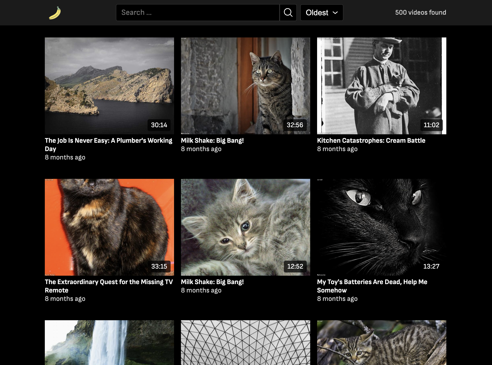

# Video Feed Website



This is a small demo project that allows users to search for videos and sort them by date. The project is built using Astro.js and Solid.js, with plain CSS for styling.

## Features

- Search for videos by title
- List of suggestions while typing
- Sort videos by date
- The state of the search and filter is saved in the URL
- Number of found videos displayed
- Infinite scrolling
- Server-side rendering
- Responsive design

## Data

The app uses 500 randomly generated videos, with the following data type:

```typescript
type Video = {
  id: string
  title: string
  thumbnail: string
  publish_date: string
  duration: number
}
```

## Tech Stack

- Typescript
- Astro.js
- Solid.js
- Docker

## How to Run

To run the app locally, follow these steps:

- Clone the repository
- Install dependencies with npm install
- Run the app with npm run dev
- Open http://localhost:4321 in your browser

## Conclusion

This project was a great opportunity to practice using Astro.js and Solid.js. I enjoyed building the search and sort functionality, and I'm happy with how the app turned out.
